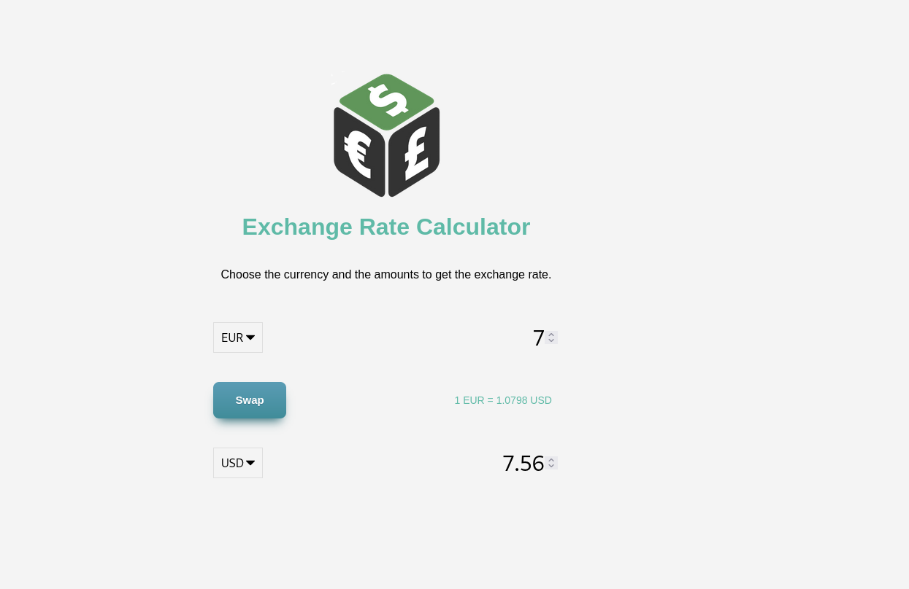

# Simple Currency Converter

This is a simple currency converter, it converts currency value from one to another. An HTML/CSS starter is made for you, you just need to focus on implementing the Javascript part

## Notes
- You are going to use a free third-party API [exchangerate-api.com](https://www.exchangerate-api.com/ "exchangerate-api.com") to calculate the exchange rate from one currency to another, take some time reading their docs to know how to use it.

## Things to change in HTML **After** completing the application
- If you notice in [index.html](./index.html), you can see that all available currencies are hardcoded in the HTML directly, refactor the code so you can add them dynamically using the Javascript.